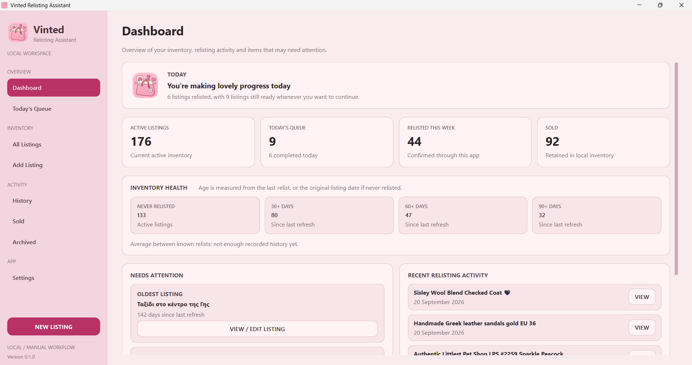
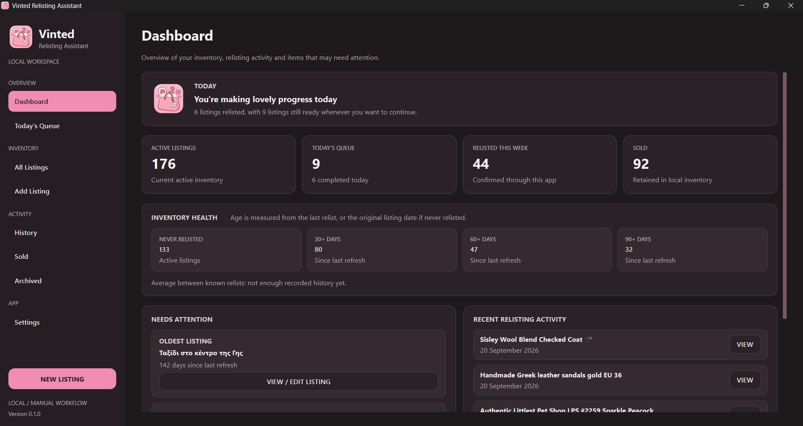
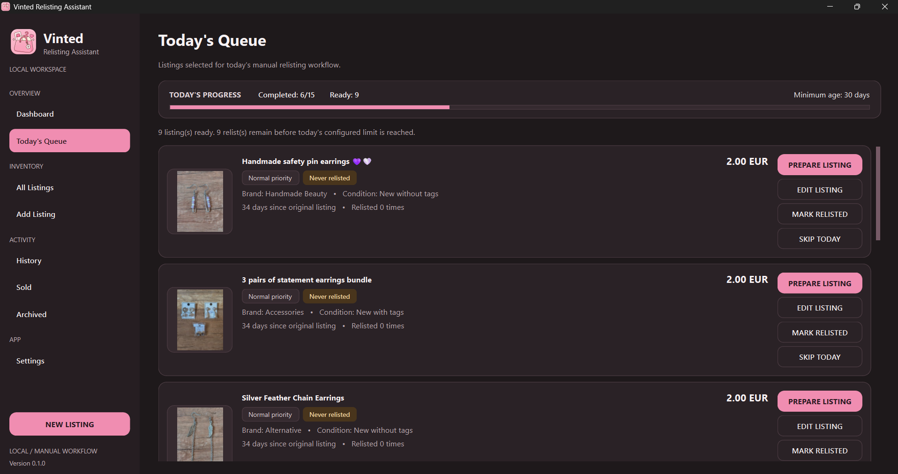
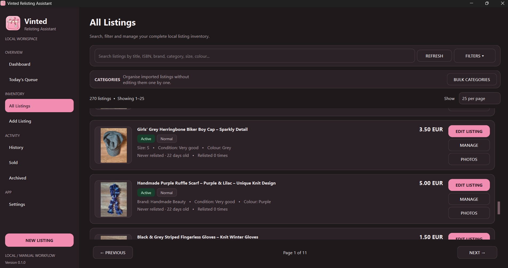
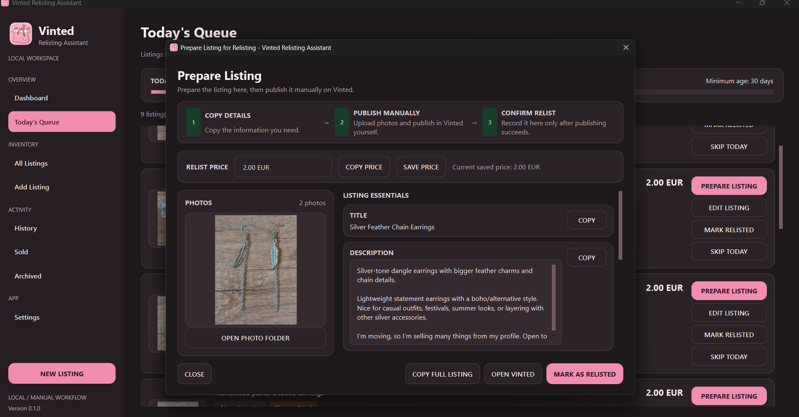
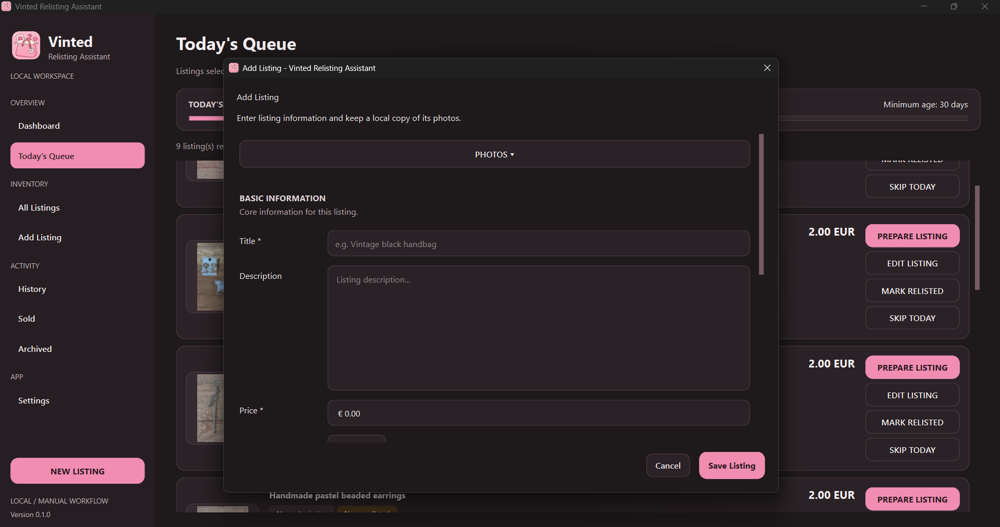

# Vinted Relisting Assistant

> A privacy-first Windows desktop application for organizing second-hand marketplace listings, planning daily relisting work, and managing a local inventory without automating marketplace actions.

**Vinted Relisting Assistant** is a desktop productivity application built with **Python, PySide6, SQLAlchemy and SQLite**.

It was designed to solve a practical problem: managing a large number of marketplace listings becomes difficult over time. Older items need attention, listing information becomes scattered, photos need to stay organized, and it can be difficult to remember which items have already been relisted.

The application provides a structured local workflow for managing that process while deliberately keeping publishing actions manual.

---

## ✨ Project Highlights

* 🖥️ Native Windows desktop interface built with **PySide6**
* 📦 Local inventory management for marketplace listings
* 📅 Intelligent **daily relisting queue**
* 🔎 Search, filtering, sorting and pagination
* 🏷️ Categories, priorities, statuses and listing metadata
* 🖼️ Local photo management with thumbnail caching
* 📊 Relisting history and activity tracking
* 💾 Local SQLite database using **SQLAlchemy**
* 📥 JSON, CSV and local Vinted-export import workflows
* 🔐 Privacy-first architecture with no marketplace credentials required
* 🧪 Automated test suite using **pytest**
* 📦 Standalone Windows executable built with **PyInstaller**

---

## 📸 Screenshots

### Dashboard

The application supports both light and dark interfaces.

<p align="center">
  
  
</p>

### Today's Relisting Queue



### All Listings



### Relisting Preparation



### Listing Editor




---

## 🎯 The Problem

Managing dozens or hundreds of second-hand listings manually creates several challenges:

* remembering which listings are old enough to relist
* keeping photos and listing information organized
* tracking previous relists
* deciding which listings should be prioritized
* finding specific items in a growing inventory
* keeping sold, archived and active items separated
* maintaining a manageable daily workflow

Vinted Relisting Assistant turns that process into a structured desktop workflow.

Instead of relying on spreadsheets, folders and memory, listing information is stored locally and surfaced through dedicated views.

---

## 🚀 Core Features

### 📅 Daily Relisting Queue

The application generates a focused daily queue from eligible listings.

Listings can be prepared one at a time and marked as relisted only after the user has manually completed the publishing process.

The queue keeps the workflow intentional and avoids repeatedly searching through the entire inventory.

---

### 🔎 Advanced Listing Browser

The **All Listings** view provides a central inventory browser with:

* text search
* status filtering
* category and subcategory filtering
* brand filtering
* size filtering
* condition filtering
* colour filtering
* minimum and maximum price filters
* priority filtering
* age filtering
* multiple sorting modes
* configurable pagination

Sorting includes relisting-aware options such as recently relisted and least/most relisted listings.

---

### 📝 Listing Management

Each listing can store structured information including:

* title
* description
* price
* currency
* category
* subcategory
* brand
* size
* condition
* colour
* material
* parcel size
* notes
* priority
* listing status
* original creation date
* last relisted date
* relist count

Listings can also be marked as:

* active
* paused
* sold
* archived
* manually excluded

---

### 🖼️ Photo Management

Listing photos are stored and managed locally.

The application includes:

* cover-photo selection
* local listing photo folders
* image previews
* cached thumbnails
* fallback states for missing or unavailable images

Scaled image previews use an in-memory cache to avoid repeatedly decoding the same image while navigating the application.

---

### 🔁 Relisting Preparation Workflow

The relisting workspace provides the information needed to manually recreate a listing.

The workflow is intentionally simple:

```text
Choose listing
      ↓
Prepare listing
      ↓
Review photo
```
